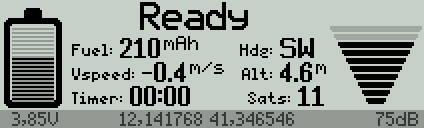

# Readme

A LUA telemetry script derived from the very fine [LuaPilot](https://github.com/ilihack/LuaPilot_Taranis_Telemetry) to work with SmartPort telemetry data from [inav](https://github.com/iNavFlight/inav) on Taranis.

The script displays the current flight mode, the battery voltage, the RSSI signal feedback, the distance from home position (if available) along with some basic telemetry data like height, GPS satellites, a timer and more. It also displays the last GPS position received, useful when you have to recover your craft after a crash.

It provides some audible feedbacks: armed/disarmed, entered/exited failsafe, GPS lock acquired/lost, started/ended autonomus flight, ready to arm, home reset, low/critical battery. You can customize the alarms by editing the WAV files in the SCRIPTS/SOUNDS directory, make sure you're using WAV files with a [format compatible to OpenTX](https://opentx.gitbooks.io/manual-for-opentx-2-2/content/advanced/audio.html) or they won't play. The audible feedbacks will play regardless if the GUI is displayed or not.

This script works with OpenTX 2.2 and has been updated with the recent changes to SPort telemetry in inav 1.8.

# Installation

* Copy the SCRIPTS directory from this repository to the root of your SD card, overwrite/merge if needed.
* Power on the radio and the model. Make sure all the model sensors are connected and powered on (some board won't power the GPS when connected via USB).
* In the radio, enter model's menu and go to the telemetry page
* (Recommended) Select *Delete all sensors*, confirm.
* Select *Discover new sensors*.
* Wait a couple of second, then select *Stop discovery*.
* Search *Fuel* sensor, edit it and change the unit to **mAh**
* Search *0420* sensor, edit it and change the name to *Dist* and unit to **m**
* In the telemetry display assign *Script* and *inav* to a screen.

Done! To view the script's screen go to the main screen and long push the "Page" button to get to the telemetry pages.  The audible feedbacks will work regardless if you're viewing the script screen or not, as long as the script is selected in the model menu as explained in the procedure above.

